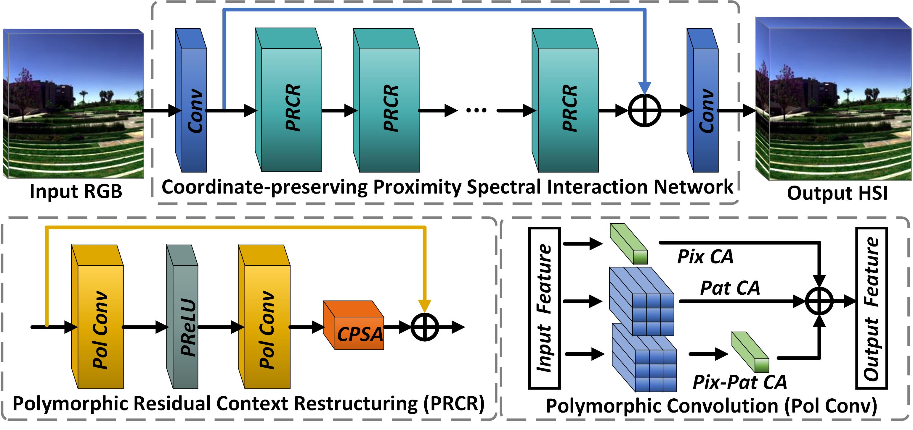

【**2023.12.12**】 The RepCPSI model havs been updated.

# RepCPSI: Coordinate-Preserving Proximity Spectral Interaction Network With Reparameterization for Lightweight Spectral Super-Resolution

Chaoxiong Wu, Jiaojiao Li, Rui Song, Yunsong Li, Qian Du. [Paper](https://ieeexplore.ieee.org/abstract/document/10092801). 

## RepCPSI framework
- Network architecture of the proposed network.

## Citation
- If the the work or the code is helpful, please cite the paper:

  @article{wu2023repcpsi,
  title={RepCPSI: Coordinate-Preserving Proximity Spectral Interaction Network With Reparameterization for Lightweight Spectral Super-Resolution},
  author={Wu, Chaoxiong and Li, Jiaojiao and Song, Rui and Li, Yunsong and Du, Qian},
  journal={IEEE Transactions on Geoscience and Remote Sensing},
  volume={61},
  pages={1--13},
  year={2023},
  publisher={IEEE}
  }
 
